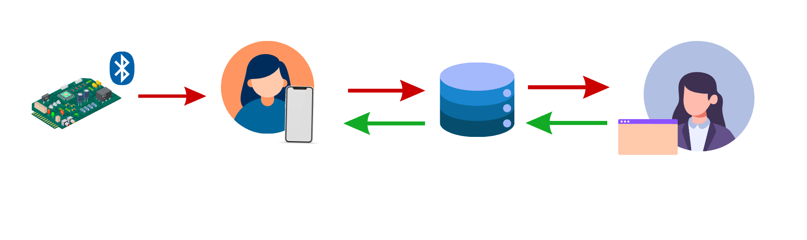
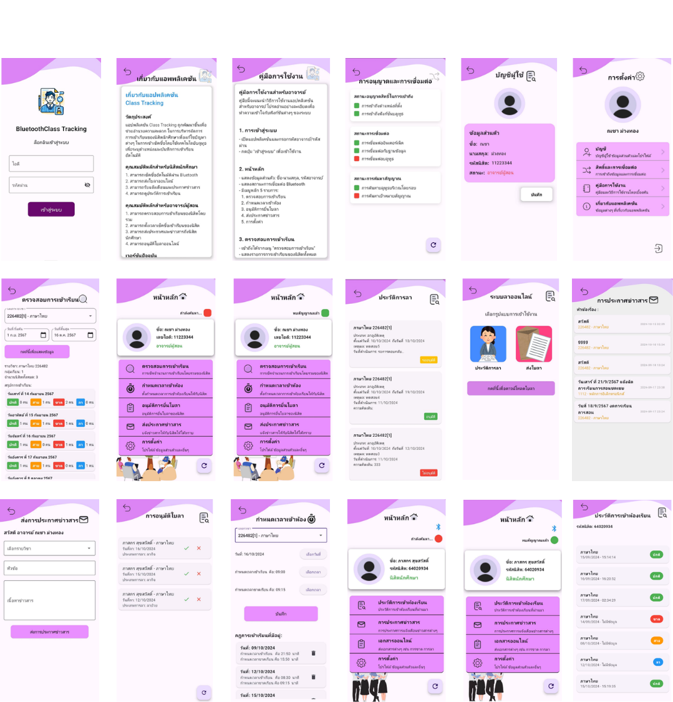
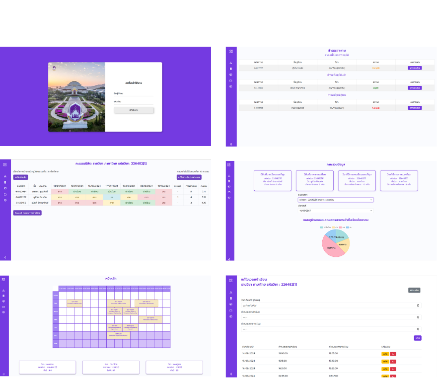
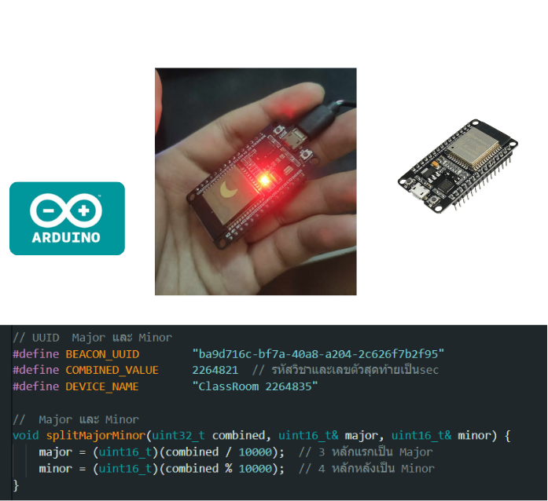
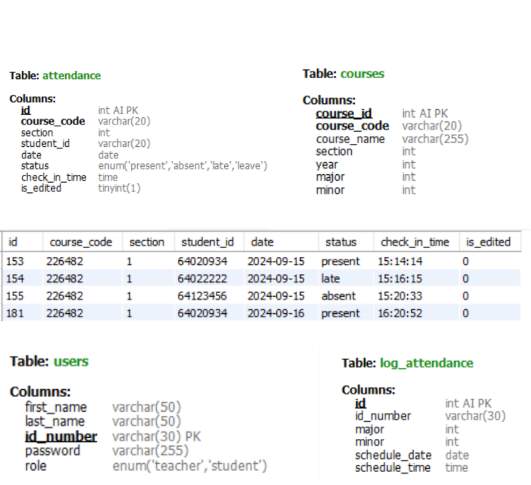

🎓 Senior Project
Tracking Student Attendance via Bluetooth Beacon
(ระบบเช็คชื่อนิสิตเข้าห้องเรียนด้วยบลูทูธบีคอน)

วันที่สำเร็จโครงการ: 18 ตุลาคม 2567

โครงงานปริญญานิพนธ์นี้พัฒนาขึ้นเพื่อแก้ไขปัญหาการเช็คชื่อและติดตามการเข้าเรียนของนิสิตภายในมหาวิทยาลัย โดยมุ่งเน้นการลดขั้นตอนการเช็คชื่อแบบเดิม ลดภาระงานของอาจารย์ผู้สอน และเพิ่มความถูกต้องของข้อมูลการเข้าเรียน
ระบบใช้เทคโนโลยี Bluetooth Beacon ในการตรวจจับสัญญาณจากอุปกรณ์มือถือของนิสิต เมื่ออยู่ภายในห้องเรียนที่กำหนด ระบบจะทำการบันทึกข้อมูลการเข้าเรียนโดยอัตโนมัติ พร้อมประมวลผลสถานะการเข้าเรียน เช่น เข้าเรียน มาสาย ขาดเรียน หรือได้รับการอนุมัติลาเรียน

โครงงานนี้ประกอบด้วยระบบย่อยทั้งหมด 4 ส่วนที่ทำงานร่วมกัน ได้แก่

ESP32 Bluetooth Beacon
Mobile Application
Web Application
MySQL Database

# Bluetooth Class Tracking

<p align="center">
  
</p>

<h1 align="center">
Tracking Student Attendance via Bluetooth Beacon
</h1>

<p align="center">
ระบบเช็คชื่อนิสิตเข้าห้องเรียนด้วยบลูทูธบีคอน
</p>

<p align="center">
Senior Project | University of Phayao | 2024
</p>

---

## 📖 About The Project

**Tracking Student Attendance via Bluetooth Beacon**  
(ระบบเช็คชื่อนิสิตเข้าห้องเรียนด้วยบลูทูธบีคอน)

โครงงานปริญญานิพนธ์นี้พัฒนาขึ้นเพื่อแก้ไขปัญหาการเช็คชื่อและติดตามการเข้าเรียนของนิสิตภายในมหาวิทยาลัย โดยใช้เทคโนโลยี Bluetooth Beacon ในการตรวจจับการเข้าห้องเรียนของนิสิตแบบอัตโนมัติ

ระบบสามารถช่วยลดภาระงานของอาจารย์ผู้สอน เพิ่มความถูกต้องของข้อมูลการเข้าเรียน และช่วยให้สามารถติดตามสถิติการเข้าเรียนของนิสิตได้อย่างมีประสิทธิภาพ

---

## 🏗️ System Overview

<p align="center">
  
</p>

ระบบประกอบด้วย 4 ส่วนหลักที่ทำงานร่วมกัน

### 📡 ESP32 Bluetooth Beacon
ทำหน้าที่ส่งสัญญาณ Bluetooth ภายในห้องเรียน

### 📱 Mobile Application
รองรับการใช้งานสำหรับนิสิตและอาจารย์

### 🌐 Web Application
ใช้สำหรับอาจารย์ในการบริหารจัดการข้อมูลการเข้าเรียน

### 🗄️ MySQL Database
จัดเก็บข้อมูลทั้งหมดของระบบ

---

# 📱 Mobile Application

## Application Preview

<p align="center">
  
</p>

Mobile Application ถูกพัฒนาด้วย Flutter เพื่อรองรับการใช้งานทั้งนิสิตและอาจารย์

## 👨‍🎓 Student Features

- เช็คชื่อเข้าเรียนอัตโนมัติผ่าน Bluetooth Beacon
- ตรวจสอบประวัติการเข้าเรียน
- ส่งใบลาออนไลน์
- แนบเอกสารประกอบการลา
- ติดตามสถานะคำร้อง
- รับประกาศจากอาจารย์
- ดูข้อมูลส่วนตัว

## 👨‍🏫 Teacher Features

- ตรวจสอบการเข้าเรียนของนิสิต
- ตรวจสอบนิสิตที่มาสาย
- ตรวจสอบนิสิตที่ขาดเรียน
- ตรวจสอบนิสิตที่ลา
- อนุมัติหรือปฏิเสธใบลา
- ดูเอกสารแนบ
- ส่งประกาศข่าวสาร
- ดูสถิติการเข้าเรียน

---

# 🌐 Web Application

## Website Preview

<p align="center">
  
</p>

เว็บไซต์สำหรับอาจารย์ผู้สอน ใช้ในการติดตามและจัดการข้อมูลการเข้าเรียนของนิสิต

### Features

- Dashboard สรุปข้อมูลการเข้าเรียน
- กราฟวิเคราะห์ข้อมูล
- จัดการรายวิชา
- จัดการตารางเรียน
- แก้ไขข้อมูลการเข้าเรียน
- ตรวจสอบสถิติการเข้าเรียน
- Export รายงาน

---

# 📡 ESP32 Bluetooth Beacon

## Hardware Preview

<p align="center">
  
</p>

ESP32 ทำหน้าที่เป็น Bluetooth Beacon ภายในห้องเรียน

### Responsibilities

- ส่งสัญญาณ Bluetooth Beacon
- ระบุห้องเรียนด้วย UUID, Major และ Minor
- ตรวจสอบการเข้าห้องเรียน
- เชื่อมต่อกับ Mobile Application
- เชื่อมต่อกับ Database

---

# 🗄️ Database

## Database Preview

<p align="center">
  
</p>

ระบบใช้ MySQL เป็นฐานข้อมูลหลักในการจัดเก็บข้อมูลทั้งหมดของระบบ

### Database Responsibilities

- จัดเก็บข้อมูลนิสิต
- จัดเก็บข้อมูลอาจารย์
- จัดเก็บข้อมูลรายวิชา
- จัดเก็บข้อมูลการเข้าเรียน
- จัดเก็บข้อมูลใบลา
- จัดเก็บข้อมูลประกาศ
- จัดเก็บข้อมูลสถิติ

---

# 🔄 System Workflow

```text
ESP32 Beacon
      │
      ▼
Mobile Application
      │
      ▼
MySQL Database
      │
      ├── Website
      └── Mobile Application
````

### Attendance Tracking

ESP32 ➜ Mobile Application ➜ Database ➜ Website/Application

### Leave Request

Student ➜ Database ➜ Teacher Review ➜ Approval Result

### Announcement

Teacher ➜ Database ➜ Students

### Analytics

Attendance Data ➜ Dashboard ➜ Reports

---

# 🛠️ Technologies Used

## Mobile Application

* Flutter
* Dart

## Web Application

* PHP
* HTML
* CSS
* JavaScript

## Database

* MySQL

## Hardware

* ESP32
* Bluetooth Low Energy (BLE)

## Development Tools

* Arduino IDE
* Visual Studio Code
* Git
* GitHub
* Node.Js
* MySQL

---

Computer Engineering
University of Phayao

Senior Project 2024
Tracking Student Attendance via Bluetooth Beacon
